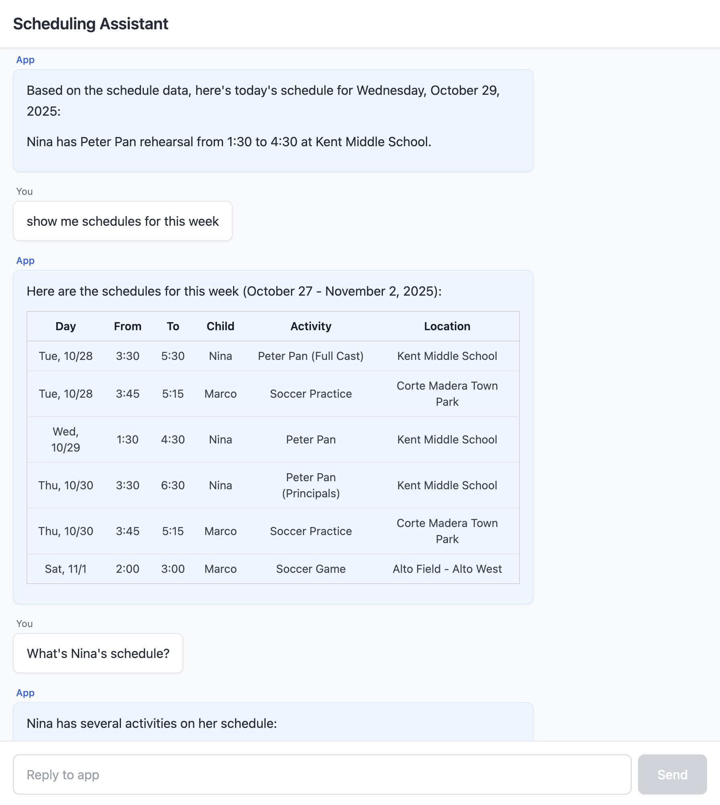

# Scheduling Assistant

A chat-based scheduling assistant powered by Claude AI to help coordinate schedules and activities.

## Overview

The assistant allows users authenticated with Google OAuth to ask questions about kid's schedules. The schedules are returned as formatted markdown. All user interactions are logged for observability.



## Tech Stack

- **Framework**: Next.js 14 (App Router)
- **Language**: TypeScript
- **Styling**: Tailwind CSS
- **Authentication**: Auth.js v5 (next-auth@beta) with Google OAuth
- **AI**: Anthropic Claude API (claude-sonnet-4-5-20250929)
- **Data Storage**: Local markdown file (version controlled)
- **Deployment**: Vercel
- **Analytics**: Vercel Analytics & Speed Insights

## Features
- **Google OAuth Authentication** - secure sign-in with Google accounts
- **Protected Routes** - middleware ensures only authenticated users can access
- **Session Management** - JWT-based sessions with automatic refresh
- **User Identification** - real Google email addresses logged for all interactions
- **Login Modal** - clean, mobile-responsive authentication UI
- **Chat Interface** Clean chat interface optimized for mobile devices
- **LLM Integration** Direct integration with Claude API (non-streaming)
- **File-based schedule storage** - no external dependencies
- **Schedule-aware responses** - Claude has context about kids' activities
- **Version controlled** - schedule changes tracked in git
- **Simple logging** - `console.log()` for all interactions
- **Left-aligned messages** - both user and app messages with visual distinction
- **Loading states** - error handling for failed requests
- **Markdown rendering** - syntax highlighting support
- **Dynamic date injection** - Pacific timezone context

## Setup

### Prerequisites

- Node.js 18+ installed
- Anthropic API key (get one at https://console.anthropic.com/)
- Google Cloud Console project with OAuth 2.0 credentials configured (see setup below)

### Local Development

1. **Clone the repository** (or navigate to the project directory)

```bash
cd scheduler
```

2. **Install dependencies**

```bash
npm install
```

3. **Configure Google OAuth**

Go to [Google Cloud Console](https://console.cloud.google.com/):
- Create a new project or select an existing one
- Enable Google+ API
- Configure OAuth consent screen
- Create OAuth 2.0 credentials (Web application type)
- Add authorized redirect URI: `http://localhost:3000/api/auth/callback/google`
- Copy the Client ID and Client Secret

4. **Set up environment variables**

Create a `.env.local` file in the root directory:

```bash
cp .env.example .env.local
```

Edit `.env.local` and add all required variables:

```
# Anthropic API
ANTHROPIC_API_KEY=your_actual_api_key_here

# Google OAuth
GOOGLE_CLIENT_ID=your_client_id.apps.googleusercontent.com
GOOGLE_CLIENT_SECRET=your_client_secret

# Auth.js (generate secret with: openssl rand -base64 32)
AUTH_SECRET=your_generated_secret
AUTH_URL=http://localhost:3000
```

5. **Run the development server**

```bash
npm run dev
```

6. **Open your browser and sign in**

Navigate to [http://localhost:3000](http://localhost:3000)

You'll be presented with a login modal. Click "Sign in with Google" to authenticate.

## Deployment to Vercel

### Initial Setup

1. **Install Vercel CLI** (optional, but recommended)

```bash
npm install -g vercel
```

2. **Deploy to Vercel**

```bash
vercel
```

Or push to GitHub and connect the repository to Vercel via the Vercel dashboard.

3. **Set Environment Variables in Vercel**

In the Vercel dashboard:
- Go to your project settings
- Navigate to "Environment Variables"
- Add the following variables (set for Production, Preview, and Development):
  - `ANTHROPIC_API_KEY` - Your Anthropic API key
  - `GOOGLE_CLIENT_ID` - Your Google OAuth client ID
  - `GOOGLE_CLIENT_SECRET` - Your Google OAuth client secret
  - `AUTH_SECRET` - Generate with `openssl rand -base64 32`

**Important**: Also update your Google Cloud Console OAuth redirect URIs to include:
- `https://your-app.vercel.app/api/auth/callback/google`

4. **Redeploy**

After setting the environment variable, trigger a new deployment.

## Project Structure

```
scheduler/
├── app/
│   ├── api/
│   │   ├── auth/
│   │   │   └── [...nextauth]/
│   │   │       └── route.ts          # Auth.js API handler
│   │   └── chat/
│   │       └── route.ts              # API endpoint for Claude
│   ├── components/
│   │   ├── AssistantMessage.tsx      # App message component
│   │   ├── LoginModal.tsx            # Google OAuth login modal
│   │   ├── MarkdownContent.tsx       # Markdown renderer
│   │   ├── SessionProviderWrapper.tsx # Auth.js session wrapper
│   │   └── UserMessage.tsx           # User message component
│   ├── globals.css                   # Global styles with Tailwind
│   ├── layout.tsx                    # Root layout with SessionProvider
│   └── page.tsx                      # Main chat interface with auth check
├── data/
│   └── schedule.md                   # Kids schedule data
├── prompts/
│   └── scheduling-assistant.md       # System prompt for Claude
├── types/
│   └── auth.ts                       # TypeScript auth types
├── auth.ts                           # Auth.js configuration
├── middleware.ts                     # Route protection middleware
├── .env.example                      # Example environment variables
├── .env.local                        # Local environment variables (git-ignored)
├── next.config.js                    # Next.js configuration
├── tailwind.config.ts                # Tailwind CSS configuration
├── tsconfig.json                     # TypeScript configuration
└── package.json                      # Dependencies and scripts
```

## Usage

1. **Open the app** in your browser
2. **Sign in with Google** - you'll see a login modal on first visit
3. **After authentication**, you'll see the chat interface
4. **Type a question** about the kids' schedule (e.g., "Does Nina have swim practice tomorrow?")
5. **Press Enter or click Send**
6. The app will:
   - Verify your authentication
   - Load the schedule from the local file
   - Send your question with schedule context to Claude
   - Display Claude's answer based on the current schedule
   - Log the interaction with your Google email

**Example questions:**
- "What does Marco have this weekend?"
- "When is Nina's next theater rehearsal?"
- "Are there any conflicts on Saturday?"

## Updating the Schedule

To update the schedule:

1. **Edit the file locally:**
   ```bash
   # Edit data/schedule.md
   git add data/schedule.md
   git commit -m "Update schedule"
   git push
   ```

2. **Or edit directly on GitHub:**
   - Navigate to `data/schedule.md` on GitHub
   - Click the "Edit" button (pencil icon)
   - Make your changes
   - Commit directly to main branch
   - Vercel will automatically redeploy

Changes take effect immediately after deployment (usually 30-60 seconds).

## Logging

All interactions are logged to the console using `console.log()`. In production (Vercel), these logs can be viewed in the Vercel dashboard under the "Logs" tab.

Logged information includes:
- **User email** (real Google email from OAuth session)
- User questions
- Claude responses
- Authentication events

## What's Next?

Future phases will include:
- **Phase 5**: User permissions config file (read/write roles)
- **Phase 6**: Memory feature to automatically update schedule
